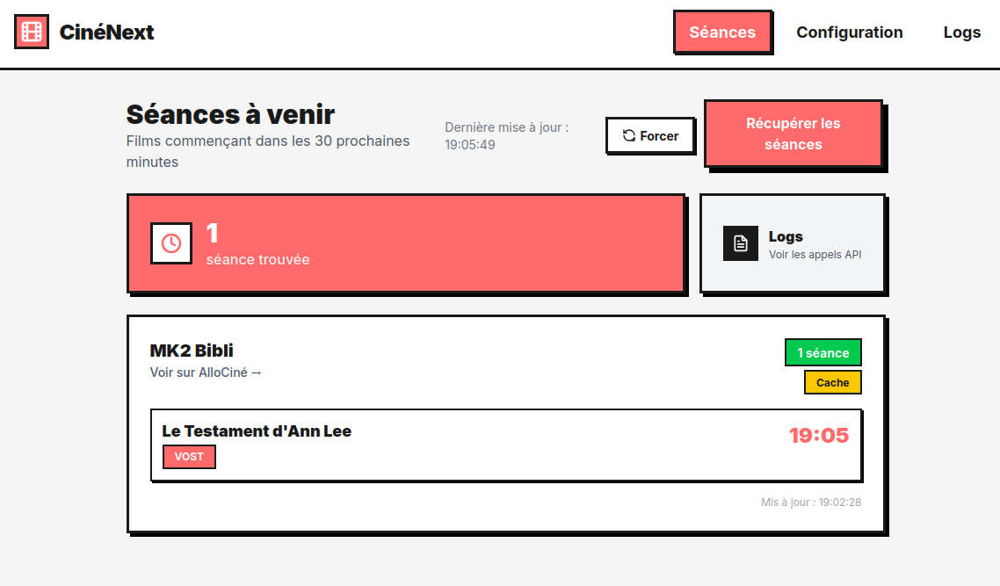

<p align="center">
  
</p>

<h1 align="center">🎬 CinéNext</h1>

<p align="center">
  <strong>Ne manquez plus jamais une séance de cinéma !</strong><br>
  Une application React qui récupère automatiquement les films projetés dans les 30 prochaines minutes.<br>
  <em>Design brutaliste, extraction IA, et open source.</em>
</p>

<p align="center">
  <a href="#"></a>
  <a href="#"></a>
  <a href="#"></a>
  <a href="#"></a>
  <a href="#"></a>
  <a href="https://app.netlify.com/start/deploy?repository=https://github.com/AlexKovax/app-cine-next"></a>
</p>

---

## ✨ Fonctionnalités

- 🤖 **Extraction IA** - Utilise OpenRouter (Claude) pour parser les pages AlloCiné
- ⚡ **Récupération instantanée** - Affiche uniquement les séances dans les 30 prochaines minutes
- 💾 **Cache intelligent** - Évite les appels API répétés avec une durée configurable
- 📊 **Logs détaillés** - Suivez chaque appel API (Jina, OpenRouter, cache) pour debug
- 🎨 **Design Brutaliste** - Interface unique avec Tailwind CSS
- 🏠 **Configuration locale** - Tout est stocké dans votre navigateur (localStorage)

---

## 🚀 Démarrage rapide

```bash
# Cloner le repo
git clone https://github.com/AlexKovax/app-cine-next.git
cd app-cine-next

# Installer les dépendances
npm install

# Lancer en développement
npm run dev
```

Puis ouvrez `http://dev.hosakka.studio:5173` (ou `localhost:5173`)

---

## 🚀 Déploiement

### Déployer sur Netlify (recommandé)

[](https://app.netlify.com/start/deploy?repository=https://github.com/AlexKovax/app-cine-next)

Ou manuellement :

1. Fork ce repo sur GitHub
2. Connectez votre repo à [Netlify](https://netlify.com)
3. La config `netlify.toml` est déjà prête :
   - Build command : `npm run build`
   - Publish directory : `dist`
   - SPA redirects configurés
4. Déployez !

### Déploiement manuel

```bash
# Build pour production
npm run build

# Le dossier dist/ contient les fichiers statiques
# Déployez-le sur n'importe quel hébergeur statique
```

---

## 🔧 Configuration

### 1. Clé API OpenRouter
- Créez un compte sur [openrouter.ai](https://openrouter.ai)
- Générez une clé API gratuite
- Collez-la dans l'onglet **Configuration**

### 2. Ajoutez vos cinémas
- Trouvez l'URL AlloCiné de votre cinéma
- Format : `https://www.allocine.fr/seance/salle_gen_csalle=[CODE].html`
- Exemples :
  - MK2 Beaubourg : `C0071`
  - UGC Ciné Cité Les Halles : `C0159`

### 3. Profitez !
Cliquez sur **"Récupérer les séances"** et voyez les films à venir dans les 30 prochaines minutes.

---

## 🏗️ Architecture

```
src/
├── pages/          # Home, Configuration, Logs
├── components/     # UI components (Navigation, CinemaCard...)
├── hooks/          # useConfig, useCache (localStorage)
├── services/       # showtimes.ts (logique IA), logging.ts
└── types/          # Types TypeScript
```

### Stack technique
- **React 19** + **TypeScript** - Pour une app robuste et moderne
- **Vite 7** - Build ultra-rapide
- **Tailwind CSS 4** - Styling utility-first
- **OpenRouter** - API LLM (Claude Haiku)
- **Jina AI** - Extraction HTML → Markdown

---

## 🤝 Contribuer

Les contributions sont les bienvenues ! Que ce soit pour :
- 🐛 Reporter un bug
- 💡 Proposer une nouvelle fonctionnalité  
- 🔧 Améliorer le code
- 🌍 Ajouter d'autres sources que AlloCiné
- 📱 Créer une version mobile/PWA

N'hésitez pas à ouvrir une issue ou une pull request !

---

## 📝 Licence

MIT License - Voir [LICENSE](LICENSE) pour plus de détails.

---

<p align="center">
  Fait avec ❤️ et 🍿 par <a href="https://github.com/AlexKovax">AlexKovax</a>
</p>

---

## Documentation technique

<details>
<summary>📖 Cliquez pour voir la documentation détaillée</summary>

### Flux de données

1. **HomePage** appelle `fetchShowtimes(cinema, config)`
2. **showtimes.ts** :
   - Récupère le markdown via Jina AI (`r.jina.ai/`)
   - Appelle OpenRouter avec un prompt système pour extraire les séances
   - Filtre les séances dans les 30 prochaines minutes
   - Retourne les séances formatées
3. **useCache** met en cache les résultats dans localStorage
4. **Logs** enregistrent tous les appels pour debugging

### Configuration persistante (`hooks/useConfig.ts`)

- Stockée dans localStorage sous la clé `cinenext-config`
- Contient : apiKey, cinemas, cacheDurationMinutes
- Les modèles IA sont hardcodés (`anthropic/claude-haiku-4.5`)

### Cache (`hooks/useCache.ts`)

- Clé : `cinenext-cache-{cinemaId}`
- TTL configurable (en minutes)
- Stocke markdown + showtimes + timestamp

### Logs (`services/logging.ts`)

- Stockés dans localStorage sous `cinenext-logs`
- Maximum 100 entrées
- Niveaux : info, success, error, warning
- Services : jina, openrouter, cache, app

### Scripts disponibles

```bash
npm run dev      # Développement
npm run build    # Build production
npm run lint     # ESLint
npm run preview  # Preview build
```

### Améliorations possibles

- [ ] Ajouter d'autres sources que AlloCiné
- [ ] Support multi-modèles avec fallback
- [ ] Export des séances (CSV, ICS)
- [ ] Notifications push pour les séances
- [ ] Mode offline avec PWA
- [ ] Tests unitaires (Jest/Vitest)

</details>
